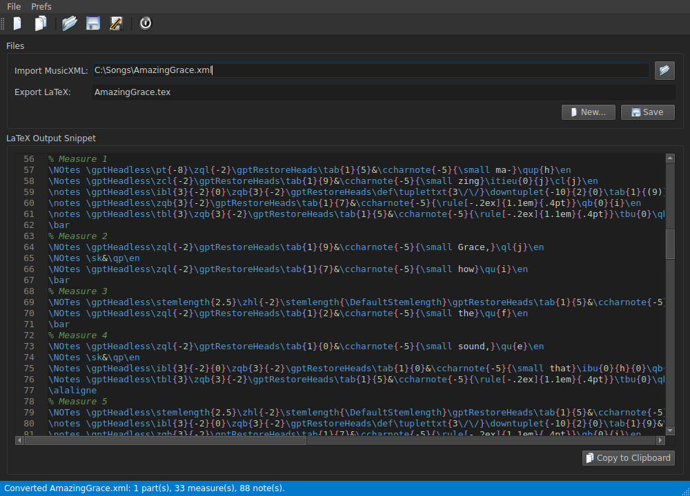
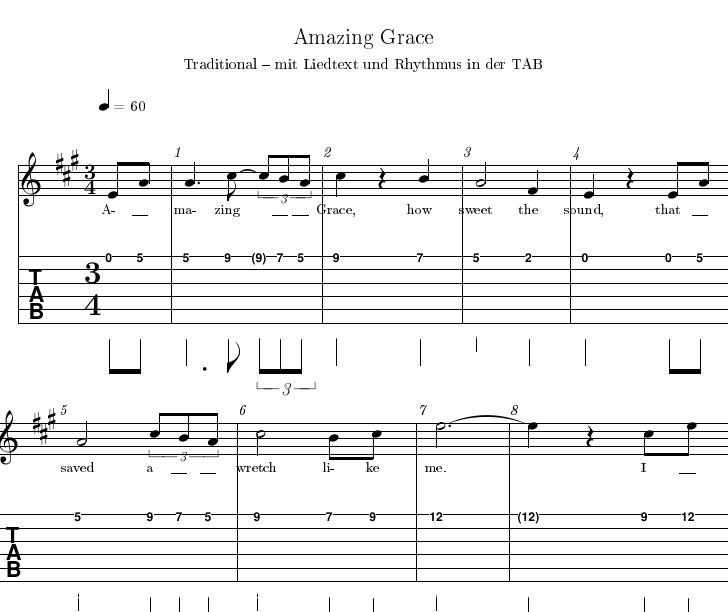

# GuitarPROtoTeX-Convert

Converts **MusicXML files exported from Guitar Pro** into **LaTeX snippets (MusiXTeX)** –
standard notation plus tablature – ready to be `\input` into your own LaTeX documents,
e.g. a songbook.





*Deutsche Kurzfassung: siehe [unten](#deutsch).*

---

## Features

- **Notation + TAB**, laid out like Guitar Pro
  - guitar notation (treble clef, 8va bassa) or – for tracks without octave transposition – plain treble clef
  - 6-line TAB with fret numbers; tied notes as `(3)`; rhythm stems, beams and tuplets **below the TAB**
  - line breaks as set in Guitar Pro, justified lines
- **Rhythm**: all note and rest values, dots, ties, beams (incl. 16ths), triplets/tuplets with brackets, grace notes
- **Several voices** (e.g. melody + bass); a note entered in both voices is printed once
- **Guitar techniques**: hammer-on / pull-off (H, P), slide, bend (↗ full, ½, …), vibrato, palm mute,
  natural harmonics `<12>`, staccato, accent, marcato, arpeggio, let-ring chords
- **Fingering**: right hand **PIMA** below the TAB
- **Chords**: chord symbols above the staff and a legend of chord diagrams (`gchords`)
- **Lyrics** below the notation, one line per verse
- **Repeats, voltas, key and time changes, tempo, text directions**, swing / triplet-feel symbol
- Output works with **`book`, `scrbook`** and other classes
- GUI: Qt 6, English/German, light and dark themes (incl. *Visual Studio Code Dark*),
  LaTeX syntax highlighting, save / copy to clipboard, all settings are stored

## Using the snippets in LaTeX

Every generated `.tex` file starts with a comment listing what it needs. In the preamble:

```latex
\usepackage{xcolor}     % white background behind the TAB fret numbers
\usepackage{musixtex}   % notation + TAB
\usepackage{gchords}    % chord diagrams (only if the snippet contains \chord)
\raggedbottom           % music systems cannot be split - don't stretch pages
```

and in the document simply `\input{MySong}`. See [`samples/Rahmendokument.tex`](samples/Rahmendokument.tex).

### Compile in three passes

MusiXTeX justifies the music lines only with its three-pass workflow:

```
musixtex -l -p mybook.tex
```

or by hand: `pdflatex mybook` → `musixflx mybook` → `pdflatex mybook`
(run `musixflx` on the **main** file). On Windows, [`samples/build_musixtex.bat`](samples/build_musixtex.bat)
does this for you.

- **Delete an old `mybook.mx2` before the first pass** after adding or removing songs –
  MusiXTeX reads it already in the first pass and stops with *“Emergency stop”* at a `\bar` if it no
  longer matches. The batch file does this automatically.
- TeXstudio: add a user command, e.g. `txs:///pdflatex | musixflx % | txs:///pdflatex | txs:///view-pdf`.
- A single `pdflatex` run also works, but the lines are then not justified.

## Tips for Guitar Pro

- Export with *File → Export → MusicXML* (uncompressed `.xml`).
- **Swing / triplet feel is not exported to MusicXML by Guitar Pro.** Add a text at that position that
  consists only of `Swing`, `Swing Feel`, `Shuffle`, `Triplet Feel` or `Triolenfeeling` – the converter
  replaces it with the swing symbol (♪♪ = ♩³♪).
- Lyrics are taken over as exported (`__` placeholders become a short line, as in Guitar Pro).
- Title and composer are **not** typeset – headings are left to your document.

## Limitations

- Only the first part (track) of a file is converted.
- Compressed MusicXML (`.mxl`) and Guitar Pro files (`.gp`, `.gpx`, `.gp5`, …) are not read.
- Left-hand fingering is read but not yet typeset.

## Building from source

Requirements: **Qt 6** (developed with Qt 6.11, MinGW 64-bit), **QScintilla 2** for Qt 6, qmake.

```
qmake GuitarPROtoTeX-Convert.pro
make            # Windows/MinGW: mingw32-make
```

or open `GuitarPROtoTeX-Convert.pro` in Qt Creator.

### Windows: deployment and installer

After linking, the build automatically

1. copies **`qscintilla2_qt6.dll`** next to the `.exe` – from the Qt `bin` folder by default, otherwise
   set `qmake "QSCINTILLA_BIN_DIR=C:/path/to/dir"`,
2. runs **`windeployqt`** on the `.exe` **and** the QScintilla DLL (Qt DLLs, plugins, Qt translations –
   including `Qt6PrintSupport.dll`, which only QScintilla needs),
3. stages everything for the installer in `installer/install_src` (`installer/install_stage.bat`).

Then open [`installer/GuitarPROtoTeX-Convert.iss`](installer/GuitarPROtoTeX-Convert.iss) in
**Inno Setup 6.3 or newer** and compile it; the setup is written to `installer/Output`.
The version number is read from the `.exe`, so `VERSION` in the `.pro` file is the only place to change it.

The post-link steps work with `cmd.exe` as well as with an `sh.exe` in the `PATH`
(e.g. from an m68k-amigaos-gcc toolchain), which makes `mingw32-make` use `sh` as its shell.

## License

GuitarPROtoTeX-Convert is free software, licensed under the
**[GNU General Public License v3](LICENSE)**.

It uses [Qt 6](https://www.qt.io/) (LGPL v3) and [QScintilla](https://riverbankcomputing.com/software/qscintilla/)
(GPL v3). Because the open-source edition of QScintilla is GPL v3, programs linked against it must be
distributed under a GPL-compatible license.

The typeset output uses MusiXTeX, `gchords` and `xcolor` from your TeX distribution.

## Author

Michael Bergmann – [github.com/mbergmann-sh](https://github.com/mbergmann-sh)

---

<a name="deutsch"></a>
## Deutsch (Kurzfassung)

**GuitarPROtoTeX-Convert** wandelt aus Guitar Pro exportierte **MusicXML-Dateien** in
**LaTeX-Snippets (MusiXTeX)** mit Noten und Tabulatur um, die per `\input` in eigene LaTeX-Dokumente
(z. B. ein Songbook) eingebunden werden.

- **Inhalt der Snippets:** Noten und TAB wie in Guitar Pro, Rhythmus unter der TAB, mehrere Stimmen,
  H/P, Slide, Bending, Vibrato, P.M., Flageolett, Akzente, Arpeggio, PIMA-Fingersatz, Akkordsymbole und
  Griffbilder, Liedtext, Wiederholungen, Volta, Swing-Symbol.
- **Präambel:** `\usepackage{xcolor}`, `\usepackage{musixtex}`, `\usepackage{gchords}`, `\raggedbottom`.
- **Übersetzen:** `musixtex -l -p buch.tex` bzw. `pdflatex` → `musixflx` → `pdflatex`; vorher eine alte
  `.mx2` löschen (`samples/build_musixtex.bat` erledigt beides).
- **Swing:** Guitar Pro exportiert „Triplet Feel“ nicht nach MusicXML – an der Stelle einen Text
  „Swing“ oder „Triplet Feel“ einfügen.
- **Windows-Build:** Das Kopieren der QScintilla-DLL und `windeployqt` (für `.exe` und QScintilla-DLL)
  laufen automatisch nach dem Linken; danach `installer/GuitarPROtoTeX-Convert.iss` mit Inno Setup (≥ 6.3) kompilieren.
- **Lizenz:** GPL v3 (wegen QScintilla, siehe oben).

Ausführliche Entwicklungsnotizen: [`docs/Entwicklungsnotizen.md`](docs/Entwicklungsnotizen.md).
# GuitarPro2TeX
